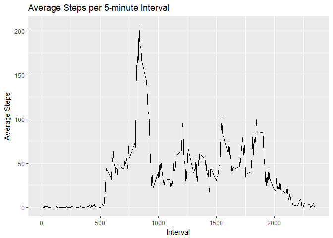
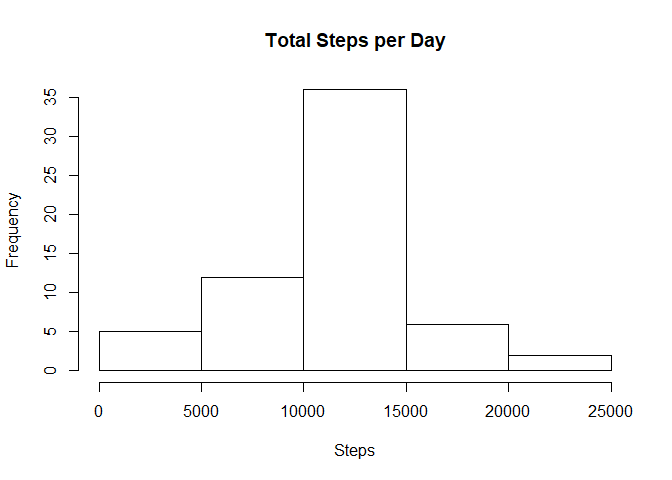
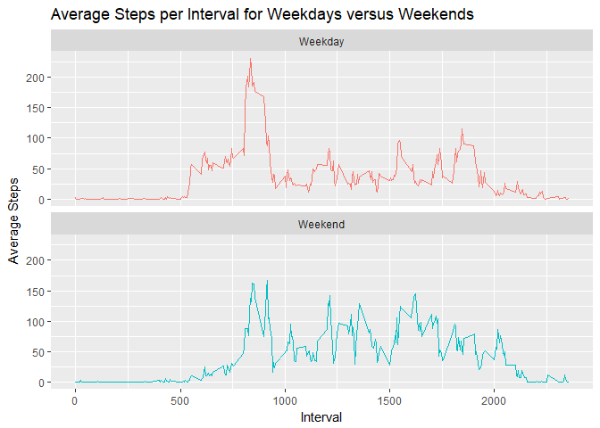

## 1.  Code for reading in the dataset and/or processing the data


```r
library(xtable)
```

```
## Warning: package 'xtable' was built under R version 3.4.4
```

```r
library(data.table)
library(dplyr)
```

```
## 
## Attaching package: 'dplyr'
```

```
## The following objects are masked from 'package:data.table':
## 
##     between, first, last
```

```
## The following objects are masked from 'package:stats':
## 
##     filter, lag
```

```
## The following objects are masked from 'package:base':
## 
##     intersect, setdiff, setequal, union
```

```r
library(lubridate)
```

```
## Warning: package 'lubridate' was built under R version 3.4.4
```

```
## 
## Attaching package: 'lubridate'
```

```
## The following objects are masked from 'package:data.table':
## 
##     hour, isoweek, mday, minute, month, quarter, second, wday,
##     week, yday, year
```

```
## The following object is masked from 'package:base':
## 
##     date
```

```r
library(ggplot2)
```

```
## Warning: package 'ggplot2' was built under R version 3.4.4
```

```r
library(knitr)
```

```
## Warning: package 'knitr' was built under R version 3.4.4
```

```r
setwd("D:/My_Files/Documents/Coursera/Reproducible Research/Week 2/proj1/")

## Download data file
if(!file.exists("./data")){dir.create("./data")}
my_url <- "https://d396qusza40orc.cloudfront.net/repdata%2Fdata%2Factivity.zip"
download.file(my_url, destfile="./data/activity.zip",  mode='wb')
unzip("./data/activity.zip", exdir = "./data")

# Read the csv into "data"
data <- fread("./data/activity.csv")
data$date <- ymd(data$date)
data$day <- weekdays(data$date)
#Remove NAs from the data
clean_d <- data[!is.na(data$steps), ]
```

## 2. Histogram of the total number of steps taken each day


```r
q2data <- summarise(group_by(clean_d, date), steps = sum(steps))
hist(q2data$steps, main = "Total Steps per Day", xlab = "Steps")
```

<!-- -->

## 3. Mean and median number of steps taken each day

```r
mean_steps <- as.integer(mean(q2data$steps))
median_steps <- as.integer(median(q2data$steps))
```
The mean of steps taken each day is 10766

The median of steps taken each day is 10765


## 4. Time series plot of the average number of steps taken


```r
q4 <- clean_d %>%
        group_by(interval) %>%
        summarise(steps= mean(steps))


g1 <- ggplot(q4, aes(x = interval, y = steps))
g1 + geom_line(stat = "identity") + 
        labs(title = "Average Steps per 5-minute Interval") +
        xlab(label = "Interval") + 
        ylab(label = "Average Steps") 
```

<!-- -->

## 5. The 5-minute interval that, on average, contains the maximum number of steps


```r
# kable(q4[which.max(q4$steps), ])  is embedded in the text below
```

This is the interval with the highest step count


 interval      steps
---------  ---------
      835   206.1698


## 6. Code to describe and show a strategy for imputing missing data

Missing data is imputed based on the average steps for that interval.  I used the dplyr method to group by the intervals and then the mututate function to add the values if data was missing.
This was based on this reference in StackOverflow: https://stackoverflow.com/questions/26336122/r-replacing-na-values-by-mean-of-hour-with-dplyr


```r
missing_data <- sum(is.na(data$steps))

i_data <- data %>%
        group_by(interval) %>%
        mutate(steps = ifelse(is.na(steps), mean(steps, na.rm=TRUE), steps))
```
There are 2304 observations in the original data that are missing step information.


## 7. Histogram of the total number of steps taken each day after missing values are imputed


```r
q7data <- i_data %>%
        group_by(date) %>%
        summarise(steps = sum(steps))

hist(q7data$steps, main = "Total Steps per Day", xlab = "Steps")
```

<!-- -->

## 8. Panel plot comparing the average number of steps taken per 5-minute interval across weekdays and weekends

<!-- -->
